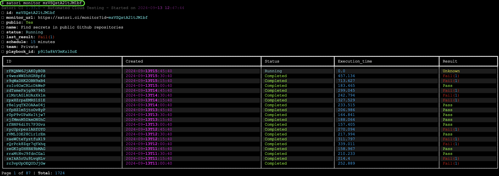

# Monitor

Monitors are an additional configuration option that can be added to playbooks. They provide a way to schedule and automate checks on live systems, ensuring they are functioning as expected over time. Monitors include a **cron** expression or a **rate** setting defined in the `settings` section, which specifies how frequently these checks should be performed.
By incorporating monitors into your playbooks, you can regularly validate that your system's behavior aligns with expected outcomes.

## Cron or Rate Settings

**Cron** and **rate settings** allow you to schedule the execution of your playbooks with a predefined frequency. These settings help automate repetitive testing tasks and monitor systems regularly, ensuring they behave as expected over time.
Cron is a time-based job scheduler in Unix-like operating systems. It allows users to schedule commands or scripts to run automatically at specified times and dates.

### Rate Setting

The **rate setting** is the simplest way to define how often a playbook should run. You specify the frequency using a natural language expression.

**Rate expression examples**:

| Frequency        | Expression       |
|------------------|------------------|
| Every 10 minutes | rate: 10 minutes |
| Every hour       | rate: 1 hour     |
| Every seven days | rate: 7 days     |

For example, the following configuration in `monitor.yml` checks every 10 minutes to verify that the Satori website is live and contains the text "Satori CI."

```yml
settings:
    name: "Verify Satori's Login"
    rate: 10 minutes
    image: curlimages/curl:7.83.1

test:
    assertStdoutContains:
      - HTTP/2 200
      - Satori CI

    curl:
      - curl -is https://satori.ci
```

To run this playbook and start monitoring:

```sh
satori run monitor.yml
```


## Managing Monitors

Once you've added monitors to your playbooks, there are several commands you can use to manage them, such as listing, stopping, starting, cleaning reports, and deleting monitors. 

#### Listing Monitors

After creating monitors, you can list all the active monitors using the `satori monitors` command:

```sh
satori monitors
```


To list only those monitors that are in a **failed state** and have **pending actions**, use the `--pending` parameter:

```bash
satori monitors --pending
```

### Stopping and Starting Monitors

You may need to stop or restart your monitors depending on your testing requirements or if changes need to be applied. Here’s how to manage the state of individual monitors:

- **Stop a Monitor:**

```sh
satori monitor MONITOR_ID stop
```

- **Start (Restart) a Monitor:**

```sh
satori monitor MONITOR_ID start
```


### Monitor's Reports

Monitors generate reports with each run. To manage these reports and the monitors themselves, you have additional commands:

```sh
satori monitor ID
```

Consider the following example:



### Clean reports and Delete Monitors

To delete all the reports generated by a specific monitor, use the `clean` command:

```sh
satori monitor MONITOR_ID clean
```

If you no longer need a monitor, you can delete it. Ensure the monitor is in a **stopped state** before deleting it:

```sh
satori monitor MONITOR_ID delete
```


---
