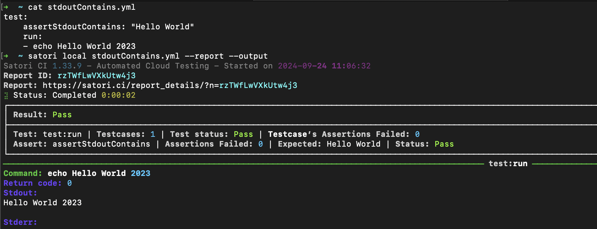
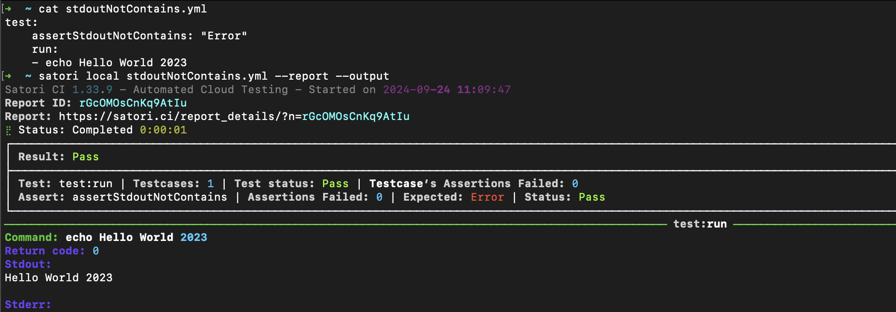
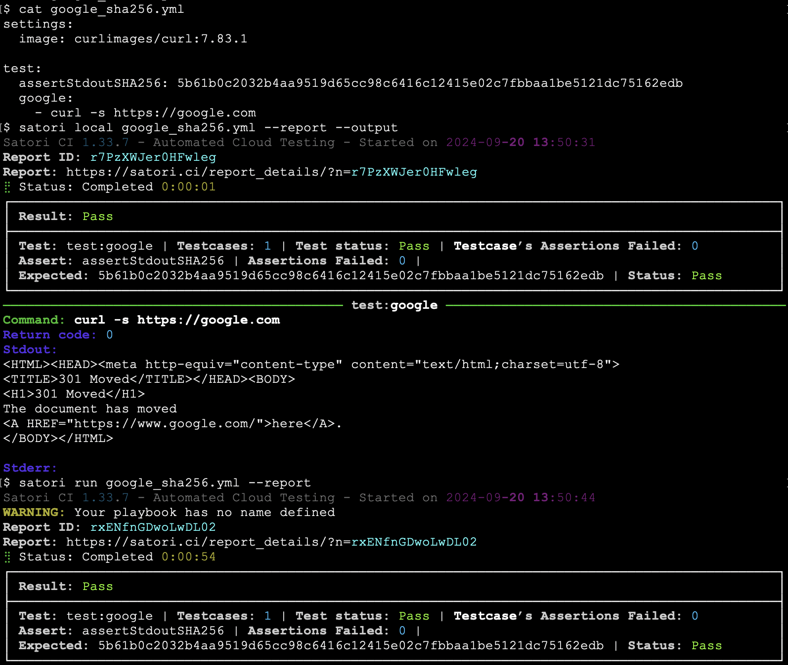
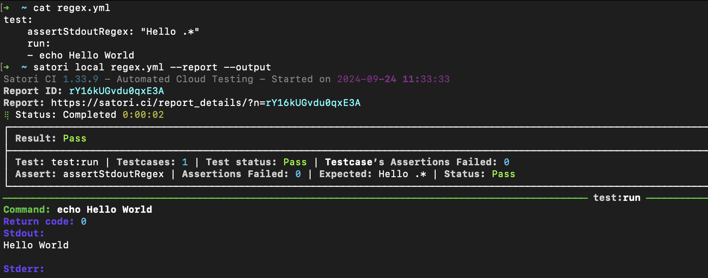

# Asserts

You can assert what will be the behavior of [executions](execution.md):

| Assert                                              | Value          | Description                                                            |
|-----------------------------------------------------|----------------|------------------------------------------------------------------------|
| [assertStdout](#assertstdout)                       | Boolean        | Is output produced?
| [assertStdoutEqual](#assertstdoutequal)             | String         | Is the output equal to the String?
| [assertStdoutNotEqual](#assertstdoutnotequal)       | String         | Is the output different than the String?
| [assertStdoutContains](#assertstdoutcontains)       | String         | Does the output contain the String?
| [assertStdoutNotContains](#assertstdoutnotcontains) | String         | Does the output not contain the String?
| [assertStdoutSHA256](#assertstdoutsha256)           | SHA256Checksum | Is the output equal to this SHA256 hash?
| [assertStdoutRegex](#assertstdoutregex)             | Regex          | Does the output match your regular expression?
| [assertStdoutNotRegex](#assertstdoutnotregex)       | Regex          | Does the output not match your regular expression?
| [assertStderr](#assertstderr)                       | Boolean        | Are errors produced?
| [assertStderrEqual](#assertstderrequal)             | String         | Is the error equal to the String?
| [assertStderrNotEqual](#assertstderrnotequal)       | String         | Is the error different than the String?
| [assertStderrContains](#assertstderrcontains)       | String         | Does the error contain the String?
| [assertStderrNotContains](#assertstderrnotcontains) | String         | Does the error not contain the String?
| [assertStderrSHA256](#assertstderrsha256)           | SHA256Checksum | Is the error equal to this SHA256 hash?
| [assertStderrRegex](#assertstderrregex)             | Regex          | Does the error match your regular expression?
| [assertStderrNotRegex](#assertstderrnotregex)       | Regex          | Does the error not match your regular expression?
| [assertReturnCode](#assertreturncode)               | Integer        | Is the return code equal to a certain value?
| [assertReturnCodeNot](#assertreturncodenot)         | Integer        | Is the return code not equal to a certain value?
| [assertSoftwareExists](#assertsoftwareexists)       | Boolean        | Does the software being executed exist? True by default
| [assertDifferent](#assertdifferent)                 | Boolean        | Does the execution behave differently when using different inputs?
| [assertKilled](#assertjilled)                       | Boolean        | Did the software time out?

---

### General usage

Asserts are defined within tests:

```yml
HelloWorld:
  assertStdoutContains: "Hello World"
  echo:
  - echo Hello World
```

And they can have a severity associated, especially useful when working with ticketing systems:

```yml
HelloWorld:
  assertStdoutContains: "Hello World"
  setSeverity: 1
  echo:
  - echo Hello World
```

You can also define multiple strings that should much, such as the following case:
```yml
install:
  - apt update
  - apt install -qy curl

test:
  assertStdoutContains: 
  - HTTP/2 200
  - Satori CI
  - info@satori-ci.com
  - nonexistentstring
  satori:
    - curl -si https://satori.ci
```

---

## assertStdout
| Input   | Description                            |
|---------|-----------------------------------------
| Boolean | Asserts if an output has been produced |

- <span style="color:green">Example Pass Test</span>: the program should deliver output, and it does:
```yml
test:
    assertStdout: True
    run:
    - echo Hello World
```

- <span style="color:red">Example Fail Test</span>: the program should deliver output, but no output is produced:

```yml
test:
    assertStdout: True
    run:
    - ./broken_executable
```

---

## assertStdoutEqual

| Input  | Description                                    |
|--------|-------------------------------------------------
| String | Asserts that the output is equal to the String |

- <span style="color:green">Example Pass Test</span>: the program should output "Hello World" and a newline, and it does:

```yml
test:
    assertStdoutEqual: "Hello World\n"
    run:
    - echo Hello World
```

- <span style="color:red">Example Fail Test</span>: the program should output "Hello World" and a newline, but it doesn't:

```yml
test:
    assertStdoutEqual: "Hello World\n"
    run:
    - echo hello world
```

---

## assertStdoutNotEqual

| Input | Description                          |
|-------|---------------------------------------
|String | Is the output different than String? |

- <span style="color:green">Example Pass Test</span>: the program output should not be equal to "Hello World", and is not:

```yml
test:
    assertStdoutNotEqual: "Hello World\n"
    input:
    - - value: "Hello World"
        mutate: radamsa
        mutate_qty: 1
    run:
    - echo ${{input}}
```

Mutations output different inputs than the one originally provided. Read more about it on the [Inputs](inputs.md#mutations) section for Playbooks.


---

## assertStdoutContains

| Input | Description |
|-------|--------------
| String         | Does the output contain the String?

- <span style="color:green">Example Pass Test</span>: the program output should contain the string "Hello World", and it does:

```yml
test:
    assertStdoutContains: "Hello World"
    run:
    - echo Hello World 2023
```



---

## assertStdoutNotContains

| Input  | Description                             |
|--------|------------------------------------------
| String | Does the output not contain the String? |
- <span style="color:green">Example Pass Test</span>: the program output should not contain the string "Error", and it does not:
```yml
test:
    assertStdoutNotContains: "Error"
    run:
    - echo Hello World
```



---

## assertStdoutSHA256
| Input          | Description                              |
|----------------|-------------------------------------------
| SHA256Checksum | Is the output equal to this SHA256 hash? |
- <span style="color:green">Example Pass Test</span>: Google's root webpage hash has not changed:

If an output should be equal to a certain hash, to confirm that its original value has not changed, you can verify that with an assert. Consider for example how Google shows consistently the same SHA 256 hash:

```sh
$ curl -s https://google.com | shasum -a 256
5b61b0c2032b4aa9519d65cc98c6416c12415e02c7fbbaa1be5121dc75162edb  -
```

At the time of writing this, the hash `5b61b0c2032b4aa9519d65cc98c6416c12415e02c7fbbaa1be5121dc75162edb` can be asserted programmatically:

You could assert that the output is consistent with that hash:
```yml
settings:
  image: curlimages/curl:7.83.1

test:
  assertStdoutSHA256: 5b61b0c2032b4aa9519d65cc98c6416c12415e02c7fbbaa1be5121dc75162edb
  google:
    - curl -s https://google.com
```



---

## assertStdoutRegex
| Input | Description                          |
|-------|---------------------------------------
| Regex | Does the output match your regular expression? |

- <span style="color:green">Example Pass Test</span>: the program output should contain the string "Hello " and additional characters, and it does:
```yml
test:
    assertStdoutRegex: "Hello .*"
    run:
    - echo Hello World
```



---

##  assertStdoutNotRegex
| Input | Description                            |
|-------|-----------------------------------------
| Regex | Does the output not match your regular expression? |

- <span style="color:gray">Example Unknown Test</span>: the program output should not contain the string "Hello World" anywhere on the output, but the input could be mutated to "somethingHello World" and the result depends on the mutation:

```yml
test:
    assertStdoutNotRegex: "*Hello World*"
    input:
    - - value: "Hello World"
        mutate: radamsa
        mutate_qty: 1
    run:
    - echo Hello ${{input}}
```

---

## assertStderr
| Input   | Description           |
|---------|-----------------------|
| Boolean | Are errors produced?  |
- <span style="color:green">Example Pass Test</span>: the program output should not output errors, and it does not:
```yml
test:
    assertStderr: False
    run:
    - echo Hello World
```
---

## assertStderrEqual
| Input    | Description                       |
|----------|------------------------------------
| String\* | Is the error equal to the String? |
- <span style="color:pass">Example Pass Test</span>: the programs should verify that the error is a certain string:
```yml
test:
  assertStderrEqual: Verify this error
  error:
  - python3 -c "import sys; sys.stderr.write('Verify this error')"
```


---

## assertStderrNotEqual
| Input  | Description                         |
|--------|--------------------------------------
| String | Is the error different than the String? |
- <span style="color:pass">Example Fail Test</span>: the programs should verify that the error is not a certain string:
```yml
test:
  assertStderrNotEqual: Verify this error
  error:
  - python3 -c "import sys; sys.stderr.write('Verify this error')"
```


---

## assertStderrContains
| Input  | Description                         |
|--------|--------------------------------------
| String | Does the error contains the String? |
- <span style="color:pass">Example Pass Test</span>: the program's errors should contain the string Traceback, and it does:
```yml
install:
   - "echo import nonexistent > test.py"
test:
    assertStderrContains: "Traceback"
    run:
    - python3 test.py
```
---

## assertStderrNotContains
| Input  | Description                            |
|--------|-----------------------------------------
| String | Does the error not contain the String? |
- <span style="color:fail">Example Fail Test</span>: the program's errors should not contain the string Traceback, but it does:
```yml
install:
   - "echo import nonexistent > test.py"
test:
    assertStderrNotContains: "Traceback"
    run:
    - python3 test.py
```
---

##  assertStderrSHA256
| Input          | Description                             |
|----------------|------------------------------------------
| SHA256Checksum | Is the error equal to this SHA256 hash? |
- <span style="color:fail">Example Fail Test</span>: the program's errors should not contain the string Traceback, but it does:
```yml
install:
   - "echo import nonexistent > test.py "
test:
    assertStderrSHA256: "69827a4c85154b891cae9c35d99887375d815ec676bb7ce86e1f7601f6fec3ad"
    run:
    - python3 test.py
```
---

## assertStderrRegex
| Input | Description                         |
|-------|--------------------------------------
| Regex | Does the error match your regular expression? |
- <span style="color:gray">Example Unknown Test</span>: the Python script my_script.py might throw a KeyError exception with 'unexpected_key' if a certain condition in the script isn't met:
```yml
RunPythonScriptTest:
    assertStderrRegex: ".*KeyError: 'unexpected_key'.*"
    run:
    - python3 my_script.py
```
---

## assertStderrNotRegex
| Input | Description                           |
|-------|----------------------------------------
| Regex | Does the error not match your regular expression? |
- <span style="color:green">Example Pass Test</span>: the program's errors should  not throw a Traceback, and it doesn't:

```yml
install:
   - "echo import os > test.py"
test:
    assertStderrNotRegex: "*Traceback*"
    run:
    - python3 test.py
```
---

## assertReturnCode
| Input   | Description                              |
|---------|-------------------------------------------
| Integer | Is the return code equal to the Integer? |
- <span style="color:green">Example Pass Test</span>: the program should return the code 0, and it does:
```yml
test:
    assertReturnCode: 0
    run:
    - echo This program is executed correctly
```
---

## assertReturnCodeNot
| Input   | Description                              |
|---------|-------------------------------------------
| Integer | Is the return code not equal to the Integer? |
- <span style="color:green">Example Positive Pass Test</span>: the program should not return the code 0, and it doesn't:

```yml
test:
    assertReturnCodeNot: 0
    run:
    - return 2
```
---

## assertSoftwareExists

| Input | Description |
|-------|--------------
| Boolean        | Does the software being executed exists? True by default
- <span style="color:fail">Example Fail Test</span>: the program should exist, and it does not:

```yml
test:
    assertSoftwareExists: True # by default
    run:
    - ./your_program
```

---

## assertDifferent
| Input   | Description                                                         |
|---------|----------------------------------------------------------------------
| Boolean | Does the execution behave differently when using different inputs? |
- <span style="color:fail">Example Fail Test</span>: the production and staging environment should look the same, and it does not:

```yml
API:
- - "www.example.com"
  - "staging.example.com"

test:
    assertDifferent: False
    run:
    - curl $API
```

---

## assertKilled
| Input   | Description                 |
|---------|------------------------------
| Boolean | Did the software time out? |
- <span style="color:fail">Example Fail Test</span>: the software should finish execution within 10 seconds, and it does not:
```yml
settings:
    software_timeout: 10

test:
    assertKilled: False
    run:
    - sleep 20
```

---

If you need any help, please reach out to us on [Discord](https://discord.gg/NJHQ4MwYtt) or via [Email](mailto:support@satori-ci.com)
